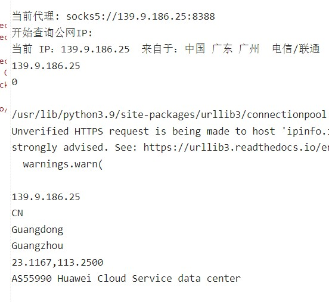

# 青龙使用代理池来避免黑IP问题
## 此文档默认为最新文档，同步脚本更新此文档
## 需要下载 ip_broker.py 、kill.py 和 copy_ip、con.xml目录的文件，否则报错
## 运行脚本

```shell
python3 ip_broker.py
```
先运行上面命令查看脚本是否有问题，没有问题运行下面命令进行，ip_broker.py只是检测脚本是否设置正确
```shell
python3 kill.py
```
脚本自动添加守护进程，只需python3 kill.py即可，请勿再添加守护进程，使用python3 kill.py可以杀死原来全部ip_broker.py的所有守护进程，而后创建新的
运行后请查看ql_acting.log日志是否有异常信息
## [青龙代理视频演示](https://youtu.be/zGoirXzPMQk)
## 脚本自动添加守护进程，只需python3 kill.py即可，会在当前目录下添加ip_broker.log控制台输出日志
## 下面是在青龙里面运行py文件检测到的IP

<br>
使用的库
根据需代码提示缺少依赖添加

```
pip3 install sqlite3
pip3 install requests
pip3 install datetime
```

### 请在con.yml文件中配置相关信息

### 查看是否添加成功
在青龙脚本管理-->新建脚本-->ip.py
把下内容进去，然后调试，脚本选择python,然后运行，如果显示代理IP表示添加成功

```python
import requests
aas = requests.get("https://ip.tool.lu/")
print("检测到的IP", aas.text)
```

代理脚本会根据抓取的代理池更新而延迟一秒钟更新，代理池大部分代理可用请放心使用

## 更新日志
#### 1.0版本
修复运行多个线程守护而对配置文件照成合并乱码删除的BUG
#### 1.1版本
添加日志输出，输出位置为当前目录下的ql_acting.log
ql_acting.log > 10M 会清空日志
#### 1.2版本
换肉不换皮，基本能封闭的都分离的
添加了sqlite3数据库，支持节点筛选
添加国外代理
优化代理检测速度，由原来单线程变成同时检测多个代理，极大减少了未来多节点的检测时间

#### 未来版本
逐渐向代理池方向发展

#### 问题：
    代理添加上不能用
    > 青龙2.10版本不支持代理添加，2.11未知，2.12支持
    > 代理池里IP只能保证添加的时候是可用的，但是添加后能用多久就不知道了，一般2-3分钟

    代理池问题
    > 不确定抓取代理池多了是否会被封IP
    > 代理池抓取的IP安全性方面无法保证，请自行选择是否使用
    > 如果因为抓取过多，而被网址封IP，可反馈，有解决方案，但是怕被某些人攻击服务器，只能当备用方案

    其他问题
    > 所有反馈都会尽量解决，但是因个人技术问题，不能保证解决所有问题
    > 以后反馈问题会在晚上十点左右回复，白天有时回复，但是不保证
    > 此脚本可能存在其他问题，请自行测试，并且反馈问题
    > 本人只能保证本人仓库的代码的没有任何偷取信息行为，如果有信息泄露，一切与本人无关
    > 此脚本仅限用于学习交流，代码在使用过程中，出现任何不法行为，本人将不承担任何责任

    
    